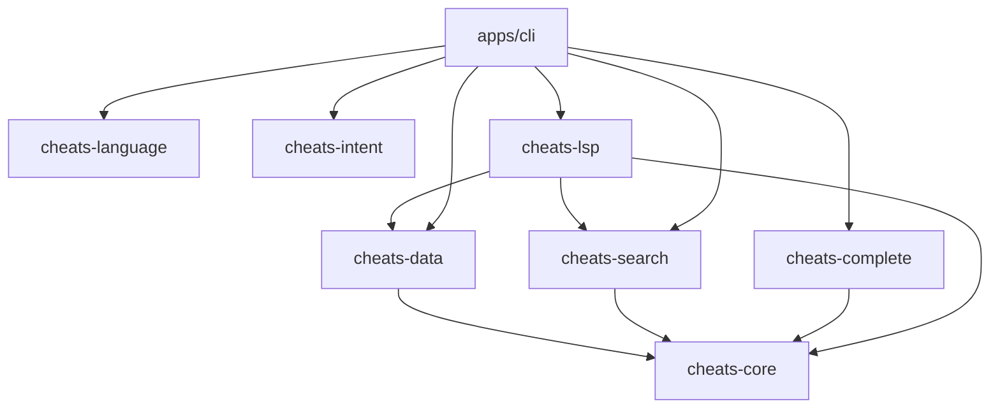

# Architecture

`rust-cheats` is an offline-first workspace. `cheats-core` owns stable serialized models; all frontends consume those models through focused crates.

## Dependency direction

The data boundary is TOML. Sheets are validated before entering search or completion. Search is deliberately backend-agnostic today: a deterministic in-memory implementation avoids an index dependency and leaves room for a persisted backend later.

## Stable contracts

`CheatSheet`, `CodeExample`, `SearchRequest`, `SearchResult`, `Suggestion`, and `CheatError` are the current public core API. Frontends should not depend on loader internals. Invalid input returns typed errors at library boundaries and contextual errors at the CLI boundary.

## Extension seams

Future grammar providers, ranking strategies, content packs, WASM bindings, and editor adapters should consume the core model rather than add frontend-specific behavior to it. Dynamic extension code is intentionally not loaded or executed.

## Known gaps

Interactive TUI behavior, registered Tree-sitter grammars, context-aware LSP document handling, WASM bindings, and packaged VS Code behavior remain follow-up work. These gaps are recorded in `docs/feature-matrix.md` rather than represented as completed functionality.
