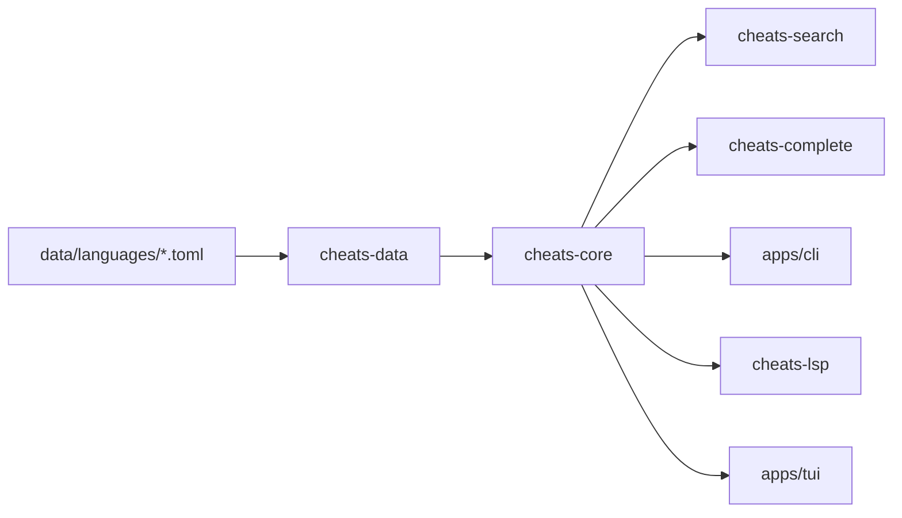

# Repository index

Generated from the `main` checkout on 2026-10-10.

## Structure

- `crates/cheats-core`: serializable domain types and validation errors.
- `crates/cheats-data`: recursive TOML loading, validation, deterministic ordering, and duplicate-ID checks.
- `crates/cheats-search`: in-memory exact, substring, and fuzzy ranking.
- `crates/cheats-complete`: prefix suggestions for sheet IDs and titles.
- `crates/cheats-language`: built-in language aliases and extensions for eight language families.
- `crates/cheats-highlight`: highlighting extension point.
- `crates/cheats-intent`: deterministic local query classification and language extraction.
- `crates/cheats-config`: configuration extension point.
- `crates/cheats-lsp`: generic LSP server backed by local sheets.
- `apps/cli`: `rust-cheats` command-line entry point.
- `apps/tui`: terminal UI entry point (currently a starter shell).
- `data/languages`: versioned TOML content.
- `integrations`: Vim, Neovim, and VS Code adapters.
- `bindings/wasm`: WASM integration notes; no binding crate is present yet.

## Data flow

## Entrypoints

The CLI exposes `search`, `show`, `languages`, `complete`, `ask`, `completions`, `lsp`, and `tui`. The LSP uses stdio. Vim/Neovim invoke the CLI. The VS Code adapter is a TypeScript starter.

## Current coverage and risks

Core loading, validation, searching, completion, language aliases, intent parsing, privacy flags, and basic LSP initialization have implementation and unit tests. The TUI is not interactive, highlighting has no registered grammars, WASM has no crate, and the editor adapters are starter integrations. Search is an in-memory scan rather than a persisted index. Rust tooling is unavailable in the current execution environment, so compilation status must be verified in CI or a Rust-enabled environment.

The existing untracked `integrations/vscode/pnpm-lock.yaml` was present before this work and is intentionally preserved.

## Test locations

Unit tests are colocated in the core, data, search, completion, language, and intent crates. There are no protocol-level LSP or VS Code integration tests yet.

## Security and privacy notes

Content is parsed as data and never executed. The CLI has no telemetry or mandatory network access. `--private` suppresses nonessential output and does not write history; it does not hide processes or bypass monitoring.
